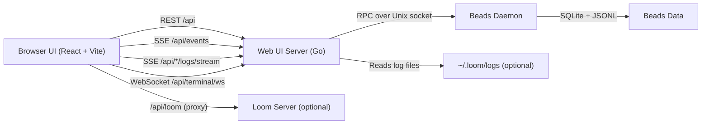

# Beads Web UI Overview

This document explains how the Beads web UI in `examples/beads-web-ui` works at a high level. It focuses on the architecture, data flow, and optional integrations rather than build or setup steps.

**Scope**
The web UI is an example app shipped with the repo. It runs locally, talks to the Beads daemon for all issue data, and adds optional agent monitoring and terminal features when Loom and tmux are available.

**Component Map**

**Frontend Responsibilities**
- Renders Kanban, Table, Graph, and Monitor views using React and TypeScript.
- Loads data via same-origin API endpoints such as `/api/issues`, `/api/stats`, and `/api/issues/graph`.
- Tracks UI state locally and updates views when mutation events arrive via SSE.
- Connects to Loom for agent status data. The default URL is `/api/loom`, which the Go server proxies to the Loom backend.
- Streams logs in the Logs tab by opening SSE connections to `/api/agents/{name}/logs/stream` and `/api/tasks/{id}/logs/{phase}/stream`.

**Backend Responsibilities**
- Serves the embedded frontend (`frontend/dist`) in production builds.
- Exposes a REST API for issue CRUD, graph data, ready lists, and stats.
- Maintains a pool of RPC connections to the Beads daemon. All data reads and writes go through this pool.
- Bridges daemon mutation events to browsers using an SSE hub.
- Hosts optional subsystems.
- Loom reverse proxy at `/api/loom/*` for agent monitoring.
- Log streaming endpoints that read Loom log files under `~/.loom/logs` and stream lines via SSE.
- Terminal WebSocket endpoint that attaches to tmux sessions.

**Read and Write Flow**
1. The browser requests the UI shell and assets from the Go server.
2. The UI fetches initial data from `/api/issues`, `/api/stats`, `/api/ready`, or `/api/issues/graph`.
3. The server turns these requests into RPC calls to the daemon.
4. The daemon reads or writes the Beads database and returns structured responses.
5. For mutations, the daemon emits a mutation event that is forwarded to all connected UI clients via SSE.

**Real-Time Updates (SSE)**
- The UI opens `EventSource` on `/api/events` to receive mutation events like `create`, `update`, `comment`, `status`, and `delete`.
- The server subscribes to daemon mutation events using `wait_for_mutations` when available, and falls back to polling `get_mutations` if not.
- Event IDs are time-ordered, and reconnections can request catch-up events by passing `since` in the SSE URL.

**Agent Monitoring and Logs**
- The Agents sidebar queries Loom for agent status and task summaries.
- The UI can stream agent or task logs from the web UI server. The backend tails `~/.loom/logs` and pushes new lines over SSE with small batching.
- If Loom is not running, the UI stays usable and simply shows the agent-monitoring sections as unavailable.

**Terminal Sessions**
- The terminal feature uses WebSockets at `/api/terminal/ws`.
- Each connection attaches to a tmux session. If the session does not exist, it is created using a default command (configured with `BEADS_TERMINAL_CMD`).
- If tmux is missing, the server disables the terminal feature and logs a warning.

**Operational Notes**
- If the Beads daemon is unavailable, the UI still loads but `/api/*` endpoints return 503 and `/api/health` reports degraded status.
- The backend auto-falls back to a nearby port if the default port is occupied.
- For local dev, Vite proxies `/api` and `/health` to the Go server, so the UI can run on `http://localhost:3000` while the API runs on `http://localhost:8080`.

**Key Files**
- `examples/beads-web-ui/main.go` for server setup, connection pooling, SSE hub, and startup.
- `examples/beads-web-ui/routes.go` for API routes and the SPA handler.
- `examples/beads-web-ui/handlers.go` for issue, stats, and graph endpoints.
- `examples/beads-web-ui/sse.go` and `examples/beads-web-ui/subscription.go` for real-time mutation streaming.
- `examples/beads-web-ui/frontend/src/api` for frontend API and SSE clients.
